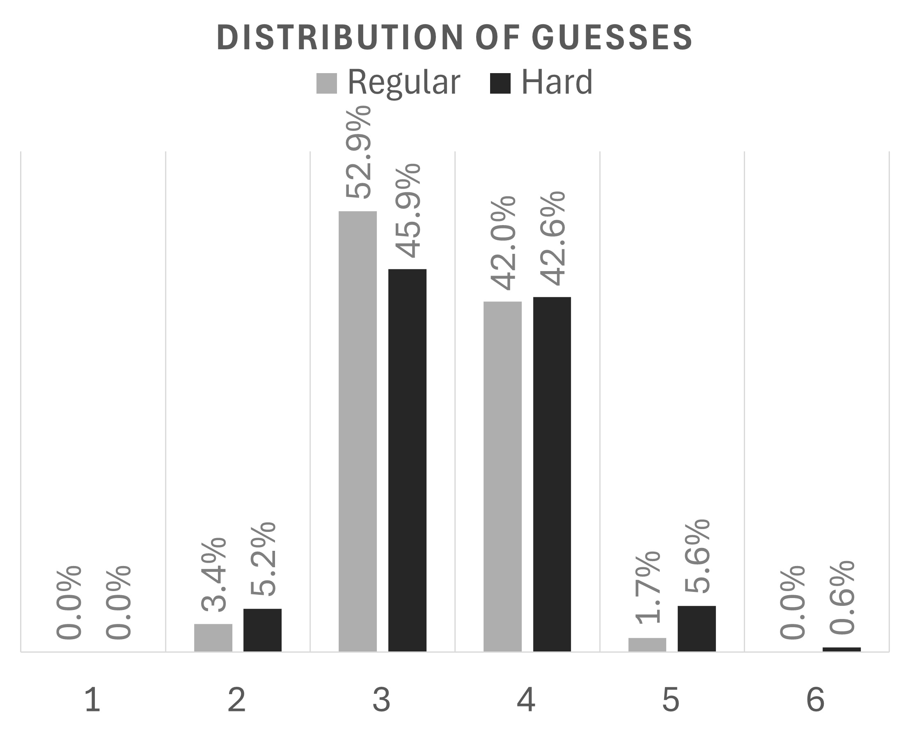
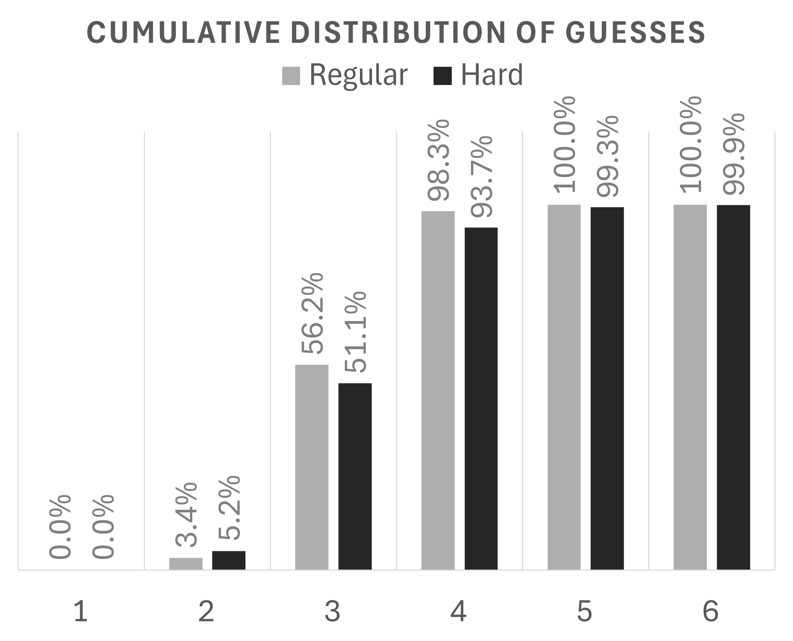

# 🔠 Wordle Optimization

[](https://igorlucindo.github.io/wordle-optimization-GAME)

This repository contains the data, code, and computational outputs for the paper:

**A Polytime and Interpretable Approach for Solving Wordle**   
Igor Lucindo, Gabriel Teodoro, Hamidreza Validi

We implement a **decision tree-based solver** for the popular game [Wordle](https://www.nytimes.com/games/wordle/index.html) to minimize the **expected number of guesses** while ensuring correctness. We explore both **normal** and **hard** modes, quantifying the trade-offs between strict constraint satisfaction (hard mode) and the freedom to choose information-maximizing probes (normal mode).

## 📊 Key Results

We evaluated our "Subtree Look-ahead" strategy against the official Wordle dataset (2,315 possible target words). All experiments were conducted on an Intel Core i7-9800X CPU and NVIDIA RTX A2000 GPU.

The word lists used for the target words and valid guesses are located in the `dataset/` folder.

### 1) Best Starting Words

The choice of the first word significantly impacts the game's trajectory. Our solver identified the following openers as mathematically efficient for minimizing expected guesses:

| Rank | Normal Mode | Exp. Guesses | Hard Mode | Exp. Guesses |
| :---: | :--- | :---: | :--- | :---: |
| **1** | `SALET` | **3.421** | `SALET` | **3.506** |
| **2** | `REAST` | 3.423 | `SLATE` | 3.510 |
| **3** | `TRACE` | 3.424 | `TRACE` | 3.512 |
| **4** | `SLATE` | 3.425 | `REAST` | 3.514 |

> **Note:** Our result of **3.421** guesses for normal mode matches the theoretical optimum reported by exact dynamic programming approaches (Bertsimas et al., 2025), but is achieved using a significantly faster polynomial-time heuristic.

### 2) Performance by Metric

We compared the baseline greedy strategy (**Avg. Size**) against our optimized look-ahead strategies (**Subtree-$k$**). As shown below, the look-ahead approaches ($k=10$ and $k=15$) yield results virtually identical to an exhaustive search (**Subtree-Full**), but with drastically lower computational cost—reducing build times from days to minutes.

| Mode | Statistic | Avg. Size | Subtree-10 | Subtree-15 | Subtree-Full |
| :--- | :--- | :---: | :---: | :---: | :---: |
| **Normal** | Exp. Guesses | 3.435 | **3.421** | **3.421** | **3.421** |
| | Max. Guesses | 6 | **5** | **5** | **5** |
| | Build Time (s) | 10.01 | 180.12 | 260.17 | $4.34 \times 10^5$ |
| **Hard** | Exp. Guesses | 3.531 | 3.507 | **3.506** | **3.506** |
| | Max. Guesses | 8 | **7** | **7** | **7** |
| | Build Time (s) | 1.00 | 10.01 | 14.01 | $1.52 \times 10^4$ |

### 3) Guess Distributions

We analyzed the stability of our heuristic by plotting the **solve rate and cumulative solve rate per number of guesses** required to solve all 2,315 words.

* **Consistency:** In Normal Mode, **100%** of games are solved within 5 guesses. Hard Mode is nearly as robust, solving **99.9%** of instances within the standard 6-guess limit.
* **Reliability:** **98.3%** of games are solved within 4 guesses in Normal Mode, while Hard Mode solves **93.8%** within the same window.

<p align="center">
  
   
</p>

> **Left:** **Solve Rate** showing the percentage of games solved in exactly $k$ guesses.  
> **Right:** **Cumulative Solve Rate** showing the total percentage solved within $k$ guesses.

### 4) GPU Acceleration For Normal Mode

To address the computational cost of look-ahead search (Normal Mode), we implemented a parallelized GPU solver. This implementation yielded **identical statistical results** (expected and maximum guesses) to the CPU version while delivering significant speed improvements.

* **Avg. Size:** Reduced build time from **10.01s** (CPU) to **1.00s** (GPU), a **90.0% reduction**.
* **Subtree-10:** Reduced build time from **180.12s** (CPU) to **23.01s** (GPU), an **87.2% reduction**.
* **Subtree-15:** Reduced build time from **260.17s** (CPU) to **36.02s** (GPU), an **86.2% reduction**.

## ✨ Features

* Implements a **polytime approach** for Wordle optimization.
* Builds a **decision tree** for solving the game efficiently.
* Aims to solve in **the minimum number of guesses possible**.
* Includes a playable version of the game hosted online.

## ⚙️ Setup

1. **Install standard dependencies:**
   ```bash
   pip install -r requirements.txt
   ```

2. **Install CuPy (for GPU acceleration):**
   To enable GPU acceleration, you must install the `cupy` package that specifically matches your installed CUDA driver version.

   Please follow the instructions in the [Official CuPy Installation Guide](https://docs.cupy.dev/en/stable/install.html).

---

## 🚀 Execution

You can run the solver using the default settings (GPU, Normal Mode) or customize the execution using command-line arguments.

### Build and Optimize Tree
To build the decision tree, run:

```bash
python application/build_tree.py
```

### Common Options:

* `--hard_mode`: Enable constraints for Hard Mode.
* `--cpu`: Run strictly on the CPU (disables GPU acceleration).
* `--save_tree`: Save the resulting tree to a JSON file (results/decision_tree.json).
* `--metric {0,1,2}`: Choose the optimization metric (default: 1).
   * `0`: Average Size (Greedy)
   * `1`: Subtree-k (Look-ahead)
   * `2`: Subtree-Full (Exhaustive)
* `--k {int}`: Number of candidates to evaluate when using Metric 1 (default: 15).

### Example:

```bash
# Build for Hard Mode and save the tree
python application/build_tree.py --hard_mode --save_tree

# Run on CPU with a greedy strategy (faster build, slightly less optimal)
python application/build_tree.py --cpu --metric 0
```

### Evaluate Our Tree:

To evaluate a saved decision tree against the full dataset:

```bash
python application/eval_tree.py
```

### Common Options:

* `--hard_mode`: Evaluate the hard mode tree (dataset/decision_tree_hard.json) instead of the normal one.
* `--cpu`: Run evaluation on the CPU.
* `--no_diagnosis`: Hide the progress bar/diagnosis output.

### Example:

```bash
# Evaluate the Hard Mode tree
python application/eval_tree.py --hard_mode
```

---

## 🎮 Interactive Game

To make the solver accessible to non-technical audiences, we provide a web-based implementation of our model. This interactive app allows users to play the game while receiving real-time hints generated by our optimization engine.

[](https://igorlucindo.github.io/wordle-optimization-GAME)

Users can use this tool to compare human intuition against the mathematically efficient strategies evaluated in this project.